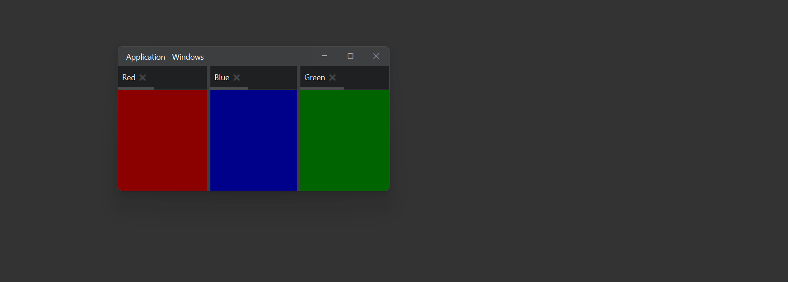

# Docktailor

[](https://central.sonatype.com/artifact/com.enosistudio/docktailor)
[](https://www.oracle.com/java/)
[](LICENSE)



**Docktailor** is a lightweight JavaFX framework for building modern user interfaces with **detachable and dockable windows**.
Inspired by the docking systems used in professional IDEs, Docktailor provides a clean, extensible architecture for creating flexible and highly customizable desktop applications.

---

## ✨ Features

* 🪟 **Detachable Windows** — Let users undock and rearrange tabs freely
* 🎯 **Simple & Intuitive API** — Designed to integrate seamlessly into existing JavaFX projects
* 🔄 **Flexible View Management** — Handle multiple views dynamically with minimal boilerplate
* 🎨 **Fully Customizable** — Easily adapt the layout, behavior, and look & feel (ships with a default IntelliJ-inspired theme)

---

## 🚀 Quick Start

**Starter Template:** [Voidstack/docktailor-template](https://github.com/Voidstack/docktailor-template)

### Requirements

* **Java 21+**
* **Maven**

  ```xml
  <dependency>
      <groupId>com.voidstack</groupId>
      <artifactId>docktailor</artifactId>
      <version>latest</version>
  </dependency>
  ```
* **Gradle**

  ```gradle
  implementation 'com.voidstack:docktailor:latest'
  ```

---

## 📝 Roadmap

* Complete API documentation
* Smooth transition
* Save separator position on SplitPane

---

## 📄 License

Licensed under the **Apache License 2.0** — see the [LICENSE](LICENSE) file for details.

---

## 🤝 Contributing

* ☕ [Buy me a coffee](https://buymeacoffee.com/enosistudio)
* ⭐ If you find this project helpful, please give it a star — it really helps!

---
